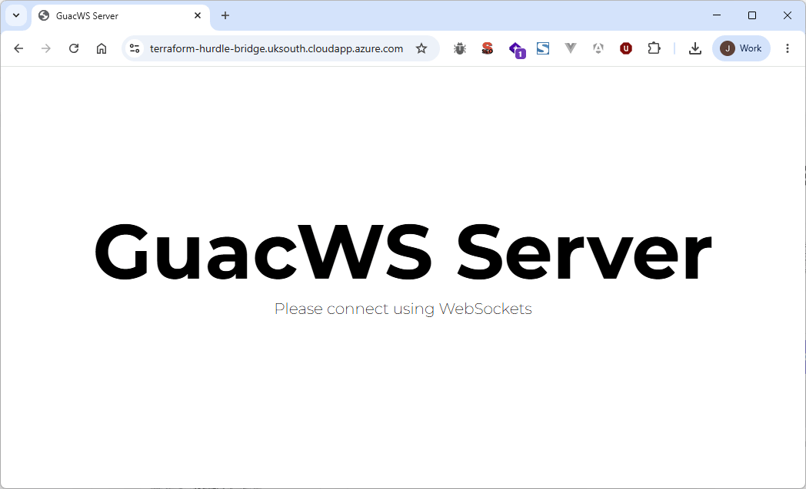

# Deploy Hurdle Labs in Azure with Terraform

## Architecture and Objectives

### Objective
Deploy the Azure resources required for your organisation to use Hurdle Labs, with a strict separation between identity-plane provisioning and infrastructure-plane provisioning.

### Target Architecture
```text
Microsoft Azure Tenant (https://portal.azure.com)
├── App Registration (Service Principal): app-hurdle-lab
│   ├── Granted "Contributor" role to Resource Group: rg-hurdle-lab
│   └── Granted "Quota Request Operator" role for the subscription the resource group belongs to
│
└── Azure Subscription
    └── Resource Group: rg-hurdle-lab
        ├── Virtual Network: vnet-hurdle-lab
        │   ├── Subnet: snet-hurdle-lab-bridge
        │   │   └── Bridge VM (permanent): vm-hurdle-lab-bridge
        │   │       ├── Attached pip-hurdle-lab-bridge
        │   │       ├── Attached nsg-hurdle-lab-bridge
        │   │       ├── Community Image: `hurdleBridge/latest`
        │   │       │   └── Includes lab tunnel services: GuacD and GuacWS
        │   │       └── Requires SSH-based configuration before first use
        │   │
        │   └── Subnet: snet-hurdle-lab-machines
        │       ├── Attached nat-hurdle-lab-machines
        │       └── Lab VMs (ephemeral, created per session/attendee)
        │
        ├── NAT Gateway: nat-hurdle-lab-machines
        │   └── Used by snet-hurdle-lab-machines
        │
        ├── Public IP: pip-hurdle-lab-bridge
        │   ├── Used by vm-hurdle-lab-bridge
        │   └── Assign domain: COMPANY-NAME-hurdle-bridge.AZURE_REGION.cloudapp.azure.com
        │
        └── Network Security Group: nsg-hurdle-lab-bridge
            ├── Network Security Group for the Bridge VM `vm-hurdle-lab-bridge`
            ├── Is automatically created when you create `vm-hurdle-lab-bridge`.
            └── Remember to allow SSH connections from your workplace VPN's public IP address!

Your workplace VPN provider
├── If you use a VPN, then whitelist your VPN's IP in the Azure Bridge's inbound rules e.g. `nsg-hurdle-lab-bridge` above.
└── If you don't, then you won't be able to SSH into `vm-hurdle-lab-bridge`.

Hurdle Trainer Dashboard (https://manage.hurdle.live)
├── "Hurdle Lab Provider" (https://manage.hurdle.live/lab/providers/new)
│   └── Tell Hurdle which Azure App Registration to use e.g. `app-hurdle-lab` above
│
├── "Hurdle Lab Bridge" (https://manage.hurdle.live/lab/bridges/new)
│   └── Defines connection to Azure Bridge e.g. wss://COMPANY-NAME-hurdle-bridge.AZURE_REGION.cloudapp.azure.com
│
├── "Hurdle Lab" (https://manage.hurdle.live/lab/instances/new)
│   └── Defines VM size, image, VNet, lab subnet, etc
│
└── "Hurdle Lab Session" (https://manage.hurdle.live/training-sessions/new)
    └── Spins up ephemeral Lab VMs using the above Lab definition
    
Hurdle Conference App
├── This is what trainers and learners actually use to join sessions and interact with each other.
├── Web version: https://app.hurdle.live
├── Desktop versions for Windows/Mac/Ubuntu can be downloaded from: https://go.hurdle.live
└── The Web/Desktop app connects to your Azure Bridge VM (vm-hurdle-lab-bridge) via a WebSocket connection.
```

### Module Structure (and Why)
- `modules/azure-hurdle-lab-identity`: app registration, service principal, and RBAC assignments.
- `modules/azure-hurdle-lab-infra`: resource group, networking, NAT, bridge NSG/public IP/NIC/VM.

This separation allows IAM-privileged operators to handle identity resources, while infrastructure operators handle resource deployment without broad Entra permissions.

## Prerequisites

### Tooling Prerequisites
- Azure CLI installed (`az`)
- Terraform installed (`terraform`)
- Azure CLI authenticated and pointed at the correct subscription

```bash
az login
az account list --output table
az account set --subscription "<SUBSCRIPTION_ID_OR_NAME>"
az account show --output table
```

If you use multiple tenants:
```bash
az login --tenant "<TENANT_ID>"
az account set --subscription "<SUBSCRIPTION_ID_OR_NAME>"
```

### Permission Prerequisites
- Identity module execution requires permissions to:
  - Create Entra app registrations and service principals
  - Assign RBAC roles at resource-group and subscription scope
- Infra module execution requires permissions to:
  - Create/update resource-group scoped network and compute resources

In short: identity-plane permissions and infrastructure-plane permissions can be delegated to different operator roles.

### Hurdle Community Compute Gallery Prerequisites
Before provisioning the bridge VM, check that Hurdle's Community Compute Gallery is available in your target Azure region:
- Community gallery name: `hurdle-ec6051c3-68bb-4651-a552-8255caddd442`
- Community gallery title: `hurdlePublicImages`

Critical regional requirement:
- **`hurdlePublicImages` must be available in the exact same region as your planned bridge VM.**
- Example #1: If you set Terraform variable `location = "uksouth"`, then `hurdlePublicImages` must be available in Azure's `UK South` region before you can deploy.
- Example #2: You gain learners in a new region and want to reduce lab latency for them. Before your can deploy Hurdle Labs in this new region (e.g. `location = "northeurope"`), `hurdlePublicImages` must be available Azure's `North Europe` region.

If this step is skipped (or done in a different region), image lookup in `terraform.tfvars.example` will return no result and bridge VM provisioning will fail.

**If `hurdlePublicImages` is not currently available in your target region, then please open a support ticket with us**: https://help.customer.hurdle.live/servicedesk/customer/portal/2/create/44.
We'll then publish `hurdlePublicImages` in your region as soon as possible.

## Deployment Runbook

### Step 0: Choose Delivery Model

Use one of these two approaches:

1. Git clone approach (recommended for teams that want the bundled examples/docs/scripts):
    ```bash
    git clone git@github.com:hurdlegroup/terraform-azurerm-hurdle-labs.git
    cd terraform-azurerm-hurdle-labs
    ```

2. Terraform Registry approach (recommended for teams composing this module from their own Terraform stack):
   - use the complete Terraform-native consumer stack in [`examples/registry-consumer`](./examples/registry-consumer)
   - that example includes:
     - `main.tf` module call
     - `variables.tf`
     - `outputs.tf` (including app secret re-export)
     - `terraform.tfvars.example`
     - usage commands in `examples/registry-consumer/README.md`

### Step 1: Enable Terraform Logging (Optional but Recommended)
To see progress details during slower Terraform operations, prefix commands with `TF_LOG=INFO`:

```bash
TF_LOG=INFO terraform plan -out tfplans/full.tfplan
TF_LOG=INFO terraform apply tfplans/full.tfplan
```

You can also set verbose logging as your shell default so all Terraform commands inherit it:

```bash
echo 'export TF_LOG=INFO' >> ~/.bashrc
echo 'export TF_LOG_PATH="$HOME/terraform.log"' >> ~/.bashrc
source ~/.bashrc

# With `export TF_LOG=INFO` now being global, normal `terraform ...` commands will output verbose logs:
terraform plan -out tfplans/full.tfplan
terraform apply tfplans/full.tfplan
```

If you only want console output and no log file, set only `TF_LOG`.

### Step 2: Plan a Bridge Web Domain and Retrieve a Hurdle Bridge Secret
1. Establish what `<bridge_subdomain_slug>-hurdle-bridge.<location>.cloudapp.azure.com` domain you want to use.
2. Go to https://manage.hurdle.live/lab/bridges/new and enter the Bridge domain you want to use, with a WebSocket protocol prefix.
For example:`wss://COMPANY-NAME-hurdle-bridge.AZURE_REGION.cloudapp.azure.com`.
3. The Hurdle server will automatically email you a Bridge Secret. You must paste this alphanumeric string into Terraform variable `bridge_lab_secret`.

### Step 3: Populate Variables

If you are using the Git clone approach, in your cloned project directory:

```bash
cp terraform.tfvars.example terraform.tfvars
```

If you are using the Terraform Registry approach:
- put the same values directly into your own root module inputs for `module "hurdle_labs"`, or
- use your own `terraform.tfvars` in that consumer repo.

Populate at minimum:
- `subscription_id`
- `tenant_id`
- `location`
- `resource_group_name`
- `app_display_name`
- `bridge_subdomain_slug`
- `bridge_admin_username`
- `bridge_vm_size` (recommended minimum: `Standard_D4s_v3`)
- `bridge_technical_contact_email`
- `bridge_lab_secret`
- `bridge_source_image_id`
- `bridge_ssh_public_key`
- `bridge_ssh_allowed_cidrs`

Critical check:
- `bridge_ssh_allowed_cidrs` must include your workplace VPN/public egress CIDR, or SSH to the bridge VM will fail.

Identity secret check:
- If `app_secret_display_name = null`, Terraform defaults the secret name to `<app_display_name> Secret v1`.
- `app_registration_client_secret_value` is sensitive and is stored in Terraform state. Protect `terraform.tfstate` and never commit it.

### Step 4: Initialize Terraform
```bash
terraform init
```

### Step 5: Validate the Configuration
```bash
terraform validate
```

### Step 6 (Approach A): Generate and Apply the Entire Terraform Plan
```bash
terraform plan -out tfplans/full.tfplan
terraform apply tfplans/full.tfplan
```

### Step 6 (Approach B): Generate and Apply Each Terraform Module Separately
By default, the root stack plans/applies both modules. If you need to execute only one side, use `-target`.

Infra module only (Git clone approach):
```bash
terraform plan -target=module.azure_hurdle_lab_infra -out tfplans/infra.tfplan
terraform apply tfplans/infra.tfplan
```

Infra module only (Terraform Registry approach):
```bash
terraform plan -target=module.hurdle_labs.module.azure_hurdle_lab_infra -out tfplans/infra.tfplan
terraform apply tfplans/infra.tfplan
```

Identity module only (Git clone approach):
```bash
terraform plan -target=module.azure_hurdle_lab_identity -out tfplans/identity.tfplan
terraform apply tfplans/identity.tfplan
```

Identity module only (Terraform Registry approach):
```bash
terraform plan -target=module.hurdle_labs.module.azure_hurdle_lab_identity -out tfplans/identity.tfplan
terraform apply tfplans/identity.tfplan
```

Important:
- If you apply each module separately, you _must_ apply `module.azure_hurdle_lab_infra` first because `module.azure_hurdle_lab_identity` needs the resource group to exist so it can assign the App Registration to it. 
- `-target` is for scoped/exception workflows. For routine changes, prefer full-stack `plan`/`apply`.
- Identity-only execution requires `resource_group_id` from the infra module, so infra state/resources must already exist.

### Step 7: Validate the `azure-hurdle-lab-infra` Deployment

1. Confirm that the deployed bridge VM is reachable and that guacws was configured and started correctly:
    ```bash
    > ssh "$(terraform output -raw bridge_admin_username)"@"$(terraform output -raw bridge_public_ip_address)" -i ~/.ssh/azure_hurdle_lab_bridge_ed25519
   
    # If Terraform complains that some outputs aren't readable, then re-sync state by running:
    > terraform apply -refresh-only
    Would you like to update the Terraform state to reflect these detected changes?
    Terraform will write these changes to the state without modifying any real infrastructure.
    There is no undo. Only 'yes' will be accepted to confirm.
    Enter a value: YES
    # Then retry the ssh command above and continue to the validation steps below...

    > sudo apt install jq
    > sudo cat /etc/guacws/appsettings.Production.json | jq
    {
        "Cipher": {
            "Key": "..."
        },
        "Server": {
            "HttpPort": 80,
            "HttpsPort": 443,
            "LetsEncrypt": {
                "Domains": [
                    "..."
                ],
                "EmailAddress": "..."
            }
        }
    }

    > sudo supervisorctl status guacws
    guacws   RUNNING   pid 1025, uptime 0:01:30
    ```
   - Expected result:
     - `/etc/guacws/appsettings.Production.json` exists with your configured domain, email, and lab secret values.
     - `supervisorctl status guacws` reports `RUNNING`.

2. Load the Bridge's URL (`bridge_public_fqdn` from `./terraform.tfstate`) in your web browser.
You should see a GuacWS server welcome page like this:
   

### Step 8: Validate the `azure-hurdle-lab-identity` Deployment

Confirm that the service principal has both required role assignments:

```bash
SP_OBJECT_ID="$(terraform output -raw service_principal_object_id)"
RG_ID="$(terraform output -raw resource_group_id)"
SUB_ID="$(az account show --query id -o tsv)"

az role assignment list --assignee-object-id "$SP_OBJECT_ID" --scope "$RG_ID" -o table
az role assignment list --assignee-object-id "$SP_OBJECT_ID" --scope "/subscriptions/$SUB_ID" -o table
```

Expected result:
- Resource group scope output includes role `Contributor` on `/subscriptions/<SUBSCRIPTION_ID>/resourceGroups/<RESOURCE_GROUP_NAME>`.
- Subscription scope output includes role `Quota Request Operator` on `/subscriptions/<SUBSCRIPTION_ID>`.

---

## 🚨 Important: Azure App Secret Rotation 🚨
- Hurdle orchestrates resources within your Azure resource group via an Azure App Registration.
- This Azure App Registration has a secret with a finite lifetime (of your choice) for security reasons.
- You are responsible for ensuring that your current Azure App Registration secret is populated in https://manage.hurdle.live/lab/providers.
- **If the App secret expires, <ins>then your Hurdle Lab Sessions will stop working.</ins>**
- **If you rotate the App secret in https://portal.azure.com but do not update the secret in https://manage.hurdle.live/lab/providers, <ins>then your Hurdle Lab Sessions will stop working.</ins>**
- Hurdle sends App secret expiry alerts 30/14/7/5/3/1 days before expiry and also shows expiry banners at the top of every page in https://manage.hurdle.live.
- Hurdle cannot rotate your Azure App secret on your behalf; only your Azure administrators can do that.
- **Strongly recommended:**
    1. Create a policy document for rotating your Azure App secret on a regular schedule e.g. `SOP: Rotate Azure Hurdle App Secret Every 3/6/9/12 Months`.
    2. Share this secret-rotation document widely within your IT team, so everyone knows how to do it, and you don't inadvertently have a Labs Training outage simply because a sysadmin was ill that day.
    3. Auto-schedule a `Rotate Hurdle Azure App Secret` task in line with your chosen App secret lifetime. This task should instruct the Azure admin to:
        1. Generate a new App secret in https://portal.azure.com and then paste it into https://manage.hurdle.live/lab/providers.
        2. Start and join a Hurdle Lab Session from https://manage.hurdle.live/training-sessions to confirm that the new App secret works as expected.

___

## Troubleshooting

### Partial Apply or Interrupted Run
Terraform is idempotent for resources tracked in state. If an apply fails midway, Terraform can usually continue from where it stopped.

How this works:
- `terraform.tfstate` in your cloned project directory is the local apply state.
- On the next `terraform plan`/`terraform apply`, Terraform compares config to this state and skips already-managed resources.

Resume safely:
```bash
terraform plan -out tfplans/resume.tfplan
terraform apply tfplans/resume.tfplan
```

Important:
- Prefer generating a fresh plan when resuming. Do not rely on an old/stale plan file from before a failure.
- If Azure resources exist but are missing from Terraform state, Terraform may try to recreate them and fail with "already exists". In that case, import the resource into state before re-applying.


## How to Replace the Bridge VM

You may need to replace the bridge VM when re-specing it (for example, changing VM size/CPU/RAM) or when you need first-boot provisioning to run again on a fresh instance.

Git clone approach:
```bash
rm -f tfplans/replace-bridge-vm.tfplan
terraform plan -target=module.azure_hurdle_lab_infra -replace=module.azure_hurdle_lab_infra.azurerm_linux_virtual_machine.bridge -out tfplans/replace-bridge-vm.tfplan
terraform apply tfplans/replace-bridge-vm.tfplan
```

Terraform Registry approach:
```bash
rm -f tfplans/replace-bridge-vm.tfplan
terraform plan -target=module.hurdle_labs.module.azure_hurdle_lab_infra -replace=module.hurdle_labs.module.azure_hurdle_lab_infra.azurerm_linux_virtual_machine.bridge -out tfplans/replace-bridge-vm.tfplan
terraform apply tfplans/replace-bridge-vm.tfplan
```

After replacement, re-run the checks in `5) How to Validate the Deployment`.

## Notes
- Runtime behavior: the bridge VM is persistent, while lab VMs are ephemeral and created by Hurdle sessions.
- First boot behavior: cloud-init writes `/etc/guacws/appsettings.Production.json`, sets `guacd:guacd` ownership, and runs `supervisorctl restart guacws`.
- If `terraform apply` fails, copy the exact error plus `az account show` output (redact IDs as needed) when requesting support.
- Keep `terraform.tfvars` environment-specific and uncommitted.
- Use `terraform.tfvars.example` as the reusable, documented template for operators.

## Appendix 1: Advanced Egress for Lab Machines

### Why Enterprises Use Advanced Egress
Some enterprise customers require outbound traffic controls beyond subnet NAT. Typical requirements include:
- central outbound inspection
- domain/IP allow-listing
- egress logging and retention
- mandatory routing through a security-managed firewall

### Egress Modes Supported by This Module
This module supports three egress modes for the `lab-machines` subnet:

- `machines_egress_mode = "nat"|null`  
  Default mode. Lab machines egress through module-managed NAT Gateway.
  ```
  Lab Machine VM
  ⮡ snet-hurdle-lab-machines
    ⮡ nat-hurdle-lab-machines
      ⮡ pip-nat-hurdle-lab-machines
        ⮡ Public Internet
  ```
- `machines_egress_mode = "firewall_module_provisioned"`  
  Module creates an Azure Firewall in the same Hurdle labs resource group and routes lab-machines egress through it.
  Baseline allow rules are included for typical endpoint behavior (DNS, NTP, ICMP, HTTP, HTTPS).
  ```
  Lab Machine VM
  ⮡ snet-hurdle-lab-machines
    ⮡ rt-hurdle-lab-machines-egress (0.0.0.0/0 ⭢ firewall private IP)
      ⮡ fw-hurdle-lab-machines-egress (AzureFirewallSubnet)
        ⮡ pip-fw-hurdle-lab-machines-egress
          ⮡ Public Internet
  ```

- `machines_egress_mode = "firewall_customer_existing"`  
  Module routes lab-machines egress to an existing customer-managed, Bring-Your-Own (BYO) firewall private IP.
  ```
  Lab Machine VM
  ⮡ snet-hurdle-lab-machines
    ⮡ machines_byo_route_table_* (or module-created machines route table)
      ⮡ customer existing firewall private IP
        ⮡ customer existing firewall public egress
          ⮡ Public Internet
  ```

### Variables Used by Advanced Egress
Related variables:
- `machines_route_table_name`
- `machines_managed_firewall_name`
- `machines_managed_firewall_pip_name`
- `machines_managed_firewall_subnet_cidr`
- `machines_byo_firewall_private_ip`
- `machines_byo_route_table_name`
- `machines_byo_route_table_resource_group_name`

### CLI Runbook: Switching Egress Mode
1. Update your variables file:
   - `machines_egress_mode = "nat"` or
   - `machines_egress_mode = "firewall_module_provisioned"` or
   - `machines_egress_mode = "firewall_customer_existing"`
2. Set mode-specific variables:
   - for `firewall_module_provisioned`: set `machines_managed_firewall_*` variables as needed.
   - for `firewall_customer_existing`: set `machines_byo_firewall_private_ip` and optionally `machines_byo_route_table_*`.
3. Generate and apply the plan:
   - Git clone approach:
      ```bash
      rm -f tfplans/machines-egress-switch.tfplan
      terraform plan -target=module.azure_hurdle_lab_infra -out tfplans/machines-egress-switch.tfplan
      terraform apply tfplans/machines-egress-switch.tfplan
      ```
   - Terraform Registry approach:
      ```bash
      rm -f tfplans/machines-egress-switch.tfplan
      terraform plan -target=module.hurdle_labs.module.azure_hurdle_lab_infra -out tfplans/machines-egress-switch.tfplan
      terraform apply tfplans/machines-egress-switch.tfplan
      ```
4. Confirm Terraform outputs reflect your target state:
   ```bash
   terraform output -raw machines_egress_mode
   terraform output machines_route_table_id
   terraform output machines_nat_gateway_id
   terraform output machines_managed_firewall_id
   terraform output machines_managed_firewall_private_ip
   ```

### Azure Portal Verification Checklist
After apply, verify in Azure portal:
- `vnet-hurdle-lab` -> `snet-hurdle-lab-machines`:
  - in `nat` mode: NAT gateway association is present.
  - in firewall modes: route table association is present.
- Route table (for firewall modes):
  - default route `0.0.0.0/0` exists.
  - next hop type is `Virtual appliance`.
  - next hop IP matches managed firewall private IP or your BYO firewall private IP.
- For `firewall_module_provisioned`:
  - `AzureFirewallSubnet` exists.
  - managed firewall and its public IP are in `Succeeded` state.
  - firewall network rule collection `machines-baseline-network` exists with:
    - `allow-dns` (TCP/UDP 53 to `*`)
    - `allow-ntp` (UDP 123 to `*`)
    - `allow-icmp` (ICMP to `*`)
  - firewall application rule collection `machines-web-browsing` exists with:
    - `allow-http-https` (HTTP 80 and HTTPS 443 to `*`)

### Hurdle Conference Acceptance Tests
After switching modes, run these acceptance checks:
1. In Hurdle Dashboard, create a new test lab session (do not rely on an old cached session).
2. Join as learner and confirm lab machine launches and reaches desktop.
3. Confirm learner internet egress through the configured firewall path:
   - inside the learner lab machine, open a web browser
   - browse to a public HTTPS site (for example, `https://www.google.com`)
   - confirm page load succeeds and normal outbound browsing works
4. Confirm bridge connectivity remains healthy:
   - browser can load `https://<bridge_public_fqdn>/`
   - websocket session establishes in Hurdle Conference.
5. Run at least one in-lab outbound test from the learner VM (for example DNS + HTTPS reachability) and confirm it behaves per policy.
6. Re-run once with a second fresh learner VM to ensure behavior is repeatable.

### Operational Caveats

- Switching modes in-place is supported, but expect short-lived outbound interruption for active lab machines during route association changes.
- `firewall_module_provisioned` requires free address space for `AzureFirewallSubnet`.
- `firewall_customer_existing` requires a valid return path and firewall policy that permits required traffic.
